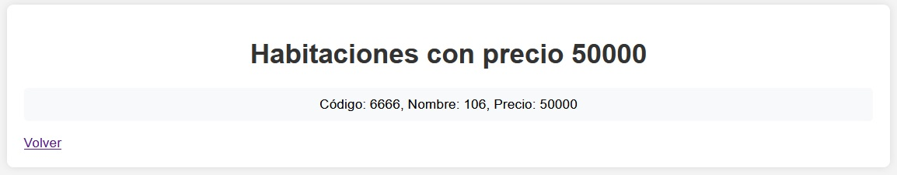
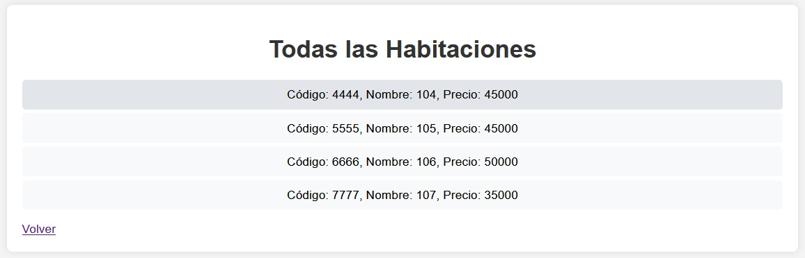

# Hotel Miras Del Mar - Sistema de Consulta de Precios

Este proyecto es un sistema web que permite a los usuarios consultar los precios de las habitaciones del Hotel Miras Del Mar, con la posibilidad de filtrar por precio y listar todas las habitaciones disponibles. Los precios se cargan desde un archivo XML, y las consultas se realizan a una base de datos MySQL mediante la extensión PDO.

## Características

- Consultar habitaciones por precio.
- Mostrar todas las habitaciones disponibles.
- Filtros para seleccionar precios desde un archivo XML.
- Base de datos MySQL para almacenar y gestionar las habitaciones.
- Uso de PDO para consultas seguras a la base de datos.
- Diseño responsive con HTML5 y CSS3.

## Requisitos

- **Servidor Web**: Apache (XAMPP o similar)
- **Lenguaje de programación**: PHP 8.2 o superior
- **Base de datos**: MySQL
- **Librerías adicionales**: PDO (incluida con PHP)
- **Frontend**: HTML5, CSS3
- **Gestión de datos**: Archivo XML para cargar precios

## Base de Datos

El proyecto utiliza una base de datos MySQL llamada `hotelmdm` que contiene una tabla `habitacion` con los siguientes campos:

- **codigo** (int): Código único de la habitación.
- **nombre** (varchar): Nombre de la habitación.
- **precio** (int): Precio de la habitación (relacionado con el archivo XML).

### Estructura de la Tabla `habitacion`

```sql
CREATE TABLE `habitacion` (
    `codigo` int(10) NOT NULL PRIMARY KEY,
    `nombre` varchar(50) NOT NULL,
    `precio` int(10) NOT NULL
);
```
## Futuras Mejoras
- **Gestión de Usuarios**: Implementar un sistema de autenticación para usuarios administradores.
- **Seguridad**: Aplicar cifrado AES para proteger la información sensible.
- **Optimización de Consultas**: Mejorar el rendimiento de las consultas a la base de datos MySQL.
- **Soporte Multilingüe**: Añadir soporte para varios idiomas en la interfaz.

## Capturas de Pantalla

### Página de Inicio


### Resultados por Precio


### Todas las Habitaciones


